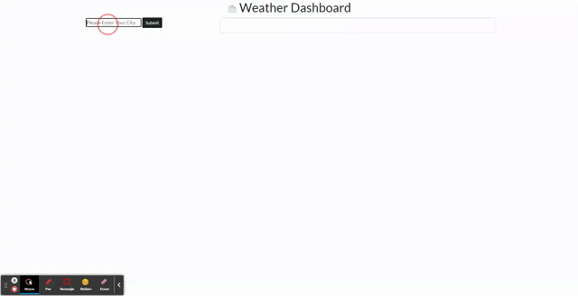

# Weather Dashboard

## Description
This weather dashboard allows a user to search for a city and see the day's weather forecast as well as the 5-day forecast for that city. Each searched city is saved for the user to re-visit using local storage. I was able to use the OpenWeatherMap API for the weather data, and I used Bootstrap for styling. 

[Deployed App](https://mistwhit.github.io/weather-dashboard/)



## User Story
```
AS A traveler
I WANT to see the weather outlook for multiple cities
SO THAT I can plan a trip accordingly
```

## Installation
If you would like to run this application locally, clone this repository and launch the application in your local browser.  

## Technolgies Used
- HTML
- CSS
- JavaScript
- OpenWeatherMap API
- Bootstrap